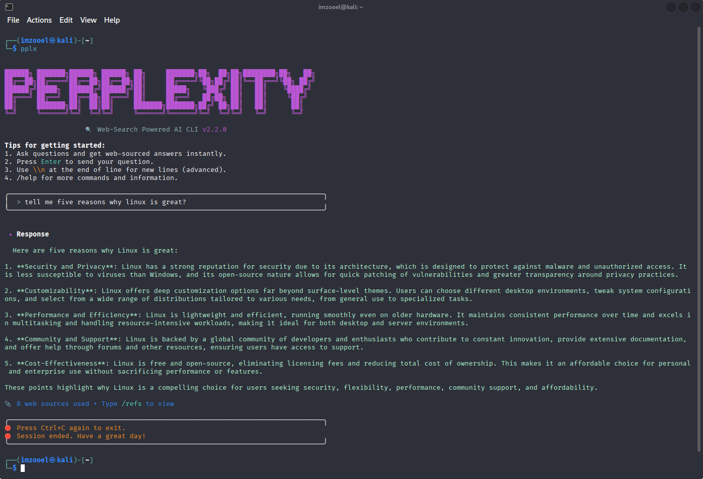

# Perplexity AI CLI

[](https://opensource.org/licenses/MIT)
[](https://python.org)
[](https://github.com/zahidoverflow/perplexity-cli)
[](https://pypa.github.io/pipx/)

An enhanced command-line interface for interacting with [Perplexity AI](https://www.perplexity.ai/) directly from your terminal.

> **Enhanced Version (v2.2.0)** with gemini-cli inspired interactive experience, modern UI, and superior usability.

<div align="center">
  
</div>

## ✨ Features

- 🚀 **Enhanced Interactive Mode**: Gemini-CLI inspired interface with modern UX
- 💬 **Smart Conversations**: Press Enter twice to send, conversation numbering  
- 🎨 **Beautiful Interface**: Bordered welcome, progress spinners, formatted responses
- ⚡ **Quick Query**: Single-line questions for immediate answers  
- 📚 **Rich References**: Access web sources with `/refs` command
- 🎨 **Colored Output**: Beautiful terminal formatting with animations
- 🔗 **Slash Commands**: `/help`, `/clear`, `/refs`, `/quit` for better control
- 🔒 **Anonymous**: No account required - uses anonymous API access
- 🌍 **Cross-Platform**: Works on Windows, macOS, and Linux
- 📦 **pipx Ready**: Optimized for isolated CLI tool installation

## 🚀 Installation Method

**pipx** is the best way to install Python CLI tools in isolated environments:

```bash
pipx install git+https://github.com/zahidoverflow/perplexity-cli.git
```


## 🔧 First-time Setup

If you don't have pipx installed, our installer will set it up automatically. Or install pipx manually:

```bash
# Windows
pip install --user pipx

# Linux (Ubuntu/Debian)
sudo apt install pipx

# Other Linux
pip install --user pipx

# macOS
brew install pipx

# Then ensure PATH is configured
pipx ensurepath
```

## 📖 Usage

### Interactive Mode

```bash
$ perplexity-cli
```

### Enhanced Interactive Commands

```bash
/help      # Show all interactive commands
/clear     # Clear the terminal screen
/refs      # Show references from last answer
/quit      # Exit gracefully  
/version   # Show version info
```

### Quick Query Mode

```bash
# Ask a quick question
perplexity-cli "What is quantum computing?"
# or
pplx "How does machine learning work?"

# Multi-word questions (quotes recommended)
perplexity-cli "Explain the difference between AI and ML"
```

### Command Options

```bash
perplexity-cli --version    # Show version information
perplexity-cli --help       # Show help message
pplx -v                     # Version (short alias)
pplx -h                     # Help (short alias)
```

## 📋 Requirements

- **Python**: 3.7 or higher
- **Internet**: Connection required for API access
- **Dependencies**: Automatically installed
  - `websocket-client>=1.6.0`
  - `requests>=2.28.0`

## 🔄 Management

### Update to Latest Version
```bash
pipx upgrade perplexity-cli
```

### List Installed CLI Apps
```bash
pipx list
```

### Reinstall if Issues
```bash
pipx reinstall perplexity-cli
```

### Clean Uninstall
```bash
pipx uninstall perplexity-cli
```

## 🐛 Troubleshooting

### Command not found after installation

```bash
# Ensure pipx PATH is configured
pipx ensurepath

# Then restart your terminal or source your profile
source ~/.bashrc  # Linux/macOS
# or restart Command Prompt/PowerShell on Windows
```

### pipx not found

```bash
# Install pipx first
pip install --user pipx

# Configure PATH
pipx ensurepath

# Restart terminal
```

### Connection errors

- Check your internet connection
- Try again after a few seconds (rate limiting)
- Perplexity may have temporary API limitations

### Installation from source fails

```bash
# Try installing with verbose output
pipx install -v git+https://github.com/zahidoverflow/perplexity-cli.git

# Or try pip fallback
pip install git+https://github.com/zahidoverflow/perplexity-cli.git
```

### Python version issues

```bash
# Check Python version
python3 --version  # Should be 3.7+

# Update Python if needed (varies by system)
# macOS: brew install python
# Ubuntu: sudo apt install python3.9
# Windows: Download from python.org
```

## Contributing

1. Fork the repository
2. Create a feature branch (`git checkout -b feature/amazing-feature`)
3. Commit your changes (`git commit -m 'Add some amazing feature'`)
4. Push to the branch (`git push origin feature/amazing-feature`)
5. Open a Pull Request

## Changelog

See [CHANGELOG.md](CHANGELOG.md) for a detailed history of changes and improvements.

## License

This project is licensed under the MIT License - see the [LICENSE](LICENSE) file for details.

## Acknowledgments

- Original implementation inspired by [HelpingAI](https://github.com/HelpingAI/Helpingai_T2)
- [Perplexity AI](https://www.perplexity.ai/) for providing the API
- Contributors and users who helped improve this tool

## Vibecoding Note

This project was built with the assistance of Gemini, an AI developed by Google. As an independent security researcher, I used AI to accelerate development and learn best practices, but I have reviewed and understood the code to ensure it aligns with my skills and goals. This demonstrates my ability to leverage modern tools while building practical cybersecurity solutions.

## Disclaimer

This is an unofficial CLI tool. Use responsibly and in accordance with Perplexity AI's terms of service.